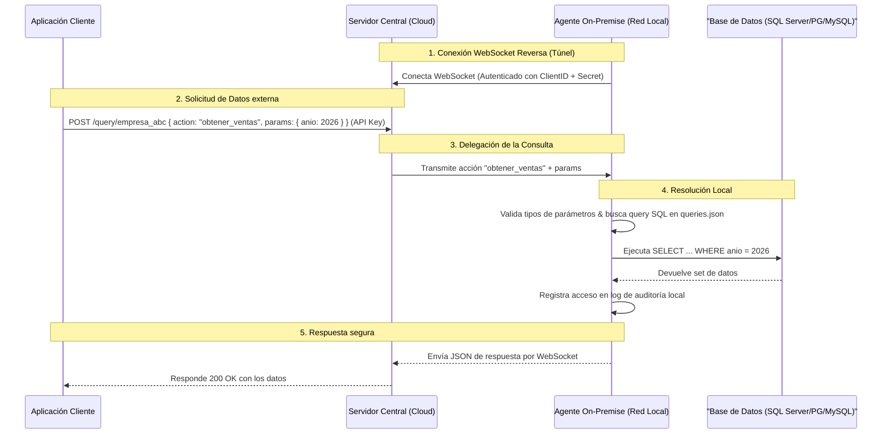

# 🛡️ AgentStructure

[](https://nodejs.org)

**Soberanía de Datos y Conectividad Segura para Entornos On-Premise.**

**AgentStructure** es una arquitectura híbrida de **Agente-Servidor** diseñada
para resolver un problema crítico de integración: permitir que aplicaciones
externas o en la nube consuman datos específicos de bases de datos locales
(On-Premise) de forma segura, **sin otorgar acceso directo a la base de datos y
manteniendo total control sobre las sentencias SQL.**

Este proyecto ha sido desarrollado como una propuesta de **Tesis de Grado** para
la implementación de soluciones empresariales en redes locales cerradas.

---

## 💡 El Problema y la Solución

### El Desafío Común

Las organizaciones suelen ser reticentes (y con razón) a exponer sus
credenciales de base de datos o abrir puertos de entrada en sus firewalls
(`3306`, `5432`, `1433`) para conectar aplicaciones externas.

### La Propuesta de AgentStructure

En lugar de que el servidor en la nube guarde las queries SQL y posea acceso
directo a la base de datos:

1. **Las queries residen localmente en el Agente**, dentro de la red
   corporativa.
2. El Servidor Central solo conoce **"nombres de acciones"** (por ejemplo:
   `obtener_clientes`) y parámetros necesarios.
3. El Agente inicia la conexión al Servidor mediante un túnel seguro
   bidireccional (**WebSockets**), evitando abrir puertos entrantes.
4. Cuando el Servidor recibe una petición HTTP, retransmite la acción al Agente,
   quien resuelve la consulta localmente, audita el acceso y retorna únicamente
   los datos crudos.

---

## 🎨 Diagrama de Conexión



---

## ✨ Características Destacadas

- 🔒 **Soberanía Absoluta del Dato:** Las sentencias SQL residen en el
  cliente/empresa. La lógica de bases de datos nunca sale de la red local.
- 🔌 **Conexión Inversa (WebSockets):** El Agente se conecta al Servidor. Cero
  configuraciones complejas de Firewall o NAT en la infraestructura corporativa.
- 🛡️ **Seguridad por Diseño:**
  - **API Key** para la comunicación entre aplicaciones y el servidor.
  - **Secretos criptográficos individuales** y únicos por cada Agente registrado
    en `agents.json`.
  - **Modo de Solo Lectura (Read-Only):** Configurable por agente para mitigar
    riesgos de inyección o alteración de datos.
- 📊 **Auditoría e Historial:** Registro persistente de accesos en el agente
  local que detalla la acción solicitada, parámetros, fecha y si fue exitosa.
- 🗄️ **Multi-Motor de Base de Datos:** Soporte nativo y pre-configurado para:
  - **PostgreSQL**
  - **MySQL** / MariaDB
  - **Microsoft SQL Server (MSSQL)**
- 💻 **Instalador Interactivo:** Un asistente por consola rápido que guía la
  inicialización de ambos roles.

---

## 📂 Estructura del Repositorio

- [`/agent`](file:///c:/Users/carlo/OneDrive/Escritorio/TRABAJO/agentstructure/agent):
  Código fuente del Agente local, resolvedor de queries y auditoría.
- [`/server`](file:///c:/Users/carlo/OneDrive/Escritorio/TRABAJO/agentstructure/server):
  Código del Servidor central que actúa como API Gateway y maneja las conexiones
  WebSocket de múltiples agentes.
- [`/landing`](file:///c:/Users/carlo/OneDrive/Escritorio/TRABAJO/agentstructure/landing):
  Landing page interactiva construida en **React + Vite** para la presentación del proyecto.
- [`install.js`](file:///c:/Users/carlo/OneDrive/Escritorio/TRABAJO/agentstructure/install.js):
  Script de configuración inicial automatizado para el entorno.

---

## 🛠️ Instalación y Configuración

El proyecto cuenta con un asistente interactivo por terminal compatible con
Windows, macOS y Linux.

### Paso 1: Clonar e Iniciar el Asistente

```bash
git clone https://github.com/PoetArtist1/agentstructure.git
cd agentstructure
node install.js
```

### Paso 2: Seguir las instrucciones en pantalla

El instalador te permitirá elegir el componente a configurar:

- **Si eliges Servidor:** Te pedirá el puerto, la API Key externa y creará la
  estructura del archivo `agents.json` donde registrarás a tus clientes
  autorizados.
- **Si eliges Agente:** Solicitará el ID asignado, el Secreto de conexión, el
  motor de base de datos a utilizar (PostgreSQL, MySQL o SQL Server) y sus
  credenciales de conexión local.

