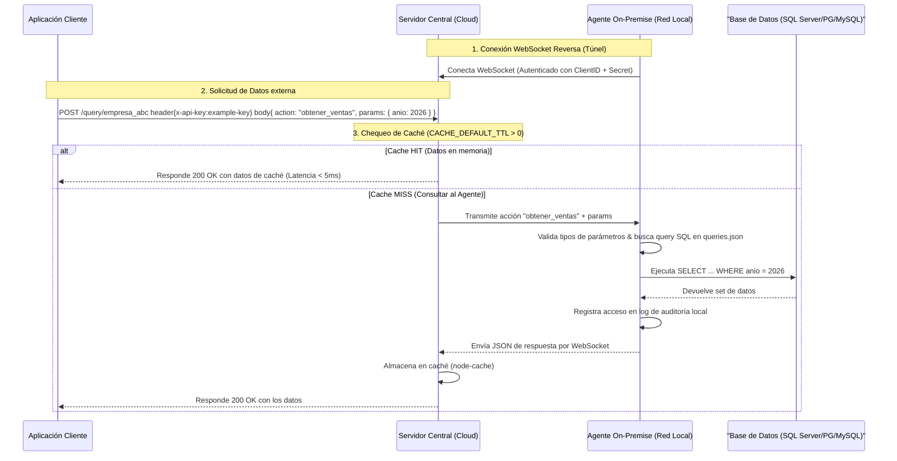
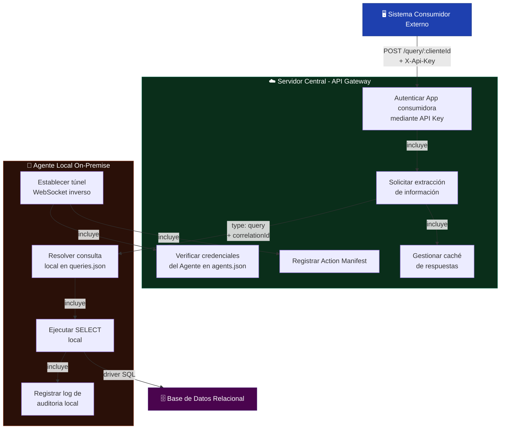
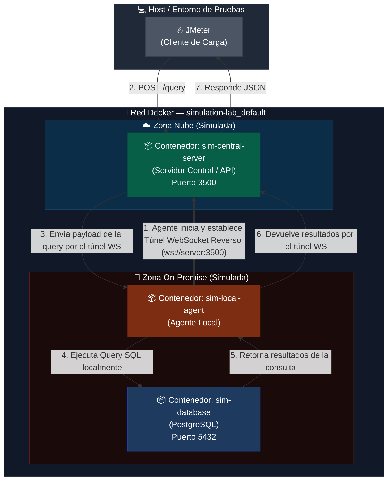
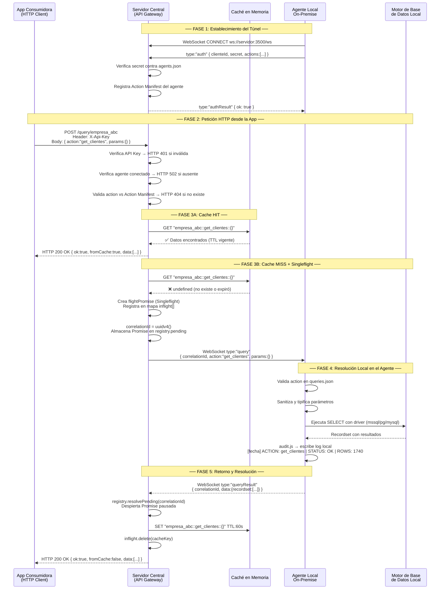

# 🛡️ AgentStructure

[](https://nodejs.org)

**Soberanía de Datos y Conectividad Segura para Entornos On-Premise.**

**AgentStructure** es una arquitectura híbrida de **Agente-Servidor** diseñada
para resolver un problema crítico de integración: permitir que aplicaciones
externas o en la nube consuman datos específicos de bases de datos locales
(On-Premise) de forma segura, **sin otorgar acceso directo a la base de datos y
manteniendo total control sobre las sentencias SQL.**

Este proyecto ha sido desarrollado como una propuesta de **Tesis de Grado** para
la implementación de soluciones empresariales en redes locales cerradas.

---

## 💡 El Problema y la Solución

### El Desafío Común

Las organizaciones suelen ser reticentes (y con razón) a exponer sus
credenciales de base de datos o abrir puertos de entrada en sus firewalls
(`3306`, `5432`, `1433`) para conectar aplicaciones externas.

### La Propuesta de AgentStructure

En lugar de que el servidor en la nube guarde las queries SQL y posea acceso
directo a la base de datos:

1. **Las queries residen localmente en el Agente**, dentro de la red
   corporativa.
2. El Servidor Central solo conoce **"nombres de acciones"** (por ejemplo:
   `obtener_clientes`) y parámetros necesarios.
3. El Agente inicia la conexión al Servidor mediante un túnel seguro
   bidireccional (**WebSockets**), evitando abrir puertos entrantes.
4. Cuando el Servidor recibe una petición HTTP, retransmite la acción al Agente,
   quien resuelve la consulta localmente, audita el acceso y retorna únicamente
   los datos crudos.

---

## 🎨 Diagrama de Conexión



---

## 📐 Diagramas de Arquitectura

### 1. Diagrama de Casos de Uso



---

### 2. Topología de Red Virtualizada (Docker)



---

### 3. Diagrama de Secuencia UML — Ciclo de Vida Completo de una Consulta



---

## 🎨 Diagrama de Conexión


---

## ✨ Características Destacadas

- 🔒 **Soberanía Absoluta del Dato:** Las sentencias SQL residen en el
  cliente/empresa. La lógica de bases de datos nunca sale de la red local.
- 🔌 **Conexión Inversa (WebSockets):** El Agente se conecta al Servidor. Cero
  configuraciones complejas de Firewall o NAT en la infraestructura corporativa.
- 🛡️ **Seguridad por Diseño:**
  - **API Key** para la comunicación entre aplicaciones y el servidor.
  - **Secretos criptográficos individuales** y únicos por cada Agente registrado
    en `agents.json`.
  - **Modo de Solo Lectura (Read-Only):** Configurable por agente para mitigar
    riesgos de inyección o alteración de datos.
- 📊 **Auditoría e Historial:** Registro persistente de accesos en el agente
  local que detalla la acción solicitada, parámetros, fecha y si fue exitosa.
- 🗄️ **Multi-Motor de Base de Datos:** Soporte nativo y pre-configurado para:
  - **PostgreSQL**
  - **MySQL** / MariaDB
  - **Microsoft SQL Server (MSSQL)**
- 💻 **Instalador Interactivo:** Un asistente por consola rápido que guía la
  inicialización de ambos roles.
- ⚡ **Caché en Memoria (Opcional):** Almacenamiento temporal integrado
  (`node-cache`) en el Servidor Central que previene la sobrecarga de consultas
  en el Agente y disminuye drásticamente la latencia en peticiones repetitivas.
- 📦 **Compresión GZIP y WebSocket Deflate:** Las respuestas HTTP se comprimen
  automáticamente con GZIP (~90% de reducción) y los mensajes WebSocket usan
  `perMessageDeflate` para minimizar el tráfico entre el Servidor y el Agente.
- 📄 **Paginación Nativa:** Soporte integrado para consultas paginadas con
  `OFFSET`/`FETCH` (SQL Server), `LIMIT`/`OFFSET` (PostgreSQL/MySQL), evitando
  la transferencia de grandes volúmenes de datos en un solo paquete.

---

## 📂 Estructura del Repositorio

- [`/agent`](file:///c:/Users/carlo/OneDrive/Escritorio/TRABAJO/agentstructure/agent):
  Código fuente del Agente local, resolvedor de queries y auditoría.
- [`/server`](file:///c:/Users/carlo/OneDrive/Escritorio/TRABAJO/agentstructure/server):
  Código del Servidor central que actúa como API Gateway y maneja las conexiones
  WebSocket de múltiples agentes.
- [`/landing`](file:///c:/Users/carlo/OneDrive/Escritorio/TRABAJO/agentstructure/landing):
  Landing page interactiva construida en **React + Vite** para la presentación
  del proyecto.
- [`install.js`](file:///c:/Users/carlo/OneDrive/Escritorio/TRABAJO/agentstructure/install.js):
  Script de configuración inicial automatizado para el entorno.

---

## 🛠️ Instalación y Configuración

El proyecto cuenta con un asistente interactivo por terminal que automatiza la
creación de los archivos de configuración en Windows, macOS y Linux.

Sigue los pasos a continuación para instalar y configurar de forma precisa tanto
el **Servidor Central** como el **Agente On-Premise**.

---

### Paso 1: Clonar el Repositorio e Instalar Dependencias

Clona el repositorio en la máquina donde vayas a trabajar e instala las
dependencias base:

```bash
git clone https://github.com/PoetArtist1/agentstructure.git
cd agentstructure
node install.js
```

El script interactivo `install.js` te guiará para configurar los componentes. Si
lo prefieres, también puedes hacer la configuración de forma manual copiando y
renombrando los archivos de plantilla que se detallan a continuación.

---

### Paso 2: Configuración del Servidor Central (Cloud)

El Servidor actúa como API Gateway y Hub de WebSockets. Requiere dos archivos
principales en el directorio `/server`:

#### 1. Archivo de Entorno: `server/.env`

Crea este archivo copiando `server/.env.example`. Este define el comportamiento
del servidor HTTP y la seguridad con la aplicación externa.

**Ejemplo de `server/.env`:**

```env
# Puerto en el que escuchará el servidor (HTTP y WebSocket comparten el mismo puerto)
PORT=3500

# API Key requerida en las peticiones HTTP externas (Header: X-Api-Key)
# Genera una segura en producción usando: node -e "console.log(require('crypto').randomBytes(32).toString('hex'))"
API_KEY=mi-clave-de-api-super-segura-cambiar-en-produccion

# Tiempo máximo (en milisegundos) a esperar por la respuesta del agente antes de retornar un 504 Gateway Timeout
QUERY_TIMEOUT_MS=30000

# Tiempo de vida en segundos de la caché en memoria (0 o vacío para desactivar)
CACHE_DEFAULT_TTL=60
```

#### 2. Registro de Agentes Autorizados: `server/agents.json`

Crea este archivo copiando `server/agents.json.example`. En él se configuran las
credenciales que usará cada agente para autenticarse por WebSocket.

**Ejemplo de `server/agents.json`:**

```json
{
  "empresa_ejemplo": {
    "secret": "generar-un-secret-unico-aqui",
    "description": "Cliente principal - Base de Datos SQL Server Local"
  },
  "sucursal_norte": {
    "secret": "otro-secret-totalmente-diferente",
    "description": "Sucursal Norte - Servidor de Ventas MySQL"
  }
}
```

- **Clave del Objeto (`empresa_ejemplo`, `sucursal_norte`)**: Corresponde al
  `clienteId` que usará el Agente para presentarse.
- **`secret`**: Contraseña secreta para validar la conexión del túnel WebSocket.
- **`description`**: Información descriptiva e interna del agente.

---

### Paso 3: Configuración del Agente On-Premise

El Agente reside dentro de la red privada de tu base de datos. Requiere dos
archivos en el directorio `/agent`:

#### 1. Archivo de Configuración: `agent/config.json`

Crea este archivo copiando `agent/config.json.example`. Contiene la URL del
servidor, las credenciales del túnel y la cadena de conexión local de la base de
datos.

**Ejemplo de `agent/config.json`:**

```json
{
  "serverUrl": "ws://localhost:3500/ws",
  "clienteId": "empresa_ejemplo",
  "secret": "generar-un-secret-unico-aqui",

  "reconnect": {
    "initialDelayMs": 1000,
    "maxDelayMs": 30000,
    "backoffMultiplier": 2
  },

  "dbEngine": "mssql",

  "db": {
    "server": "localhost",
    "port": 1433,
    "database": "MiBaseDeDatos",
    "user": "sa",
    "password": "MiPasswordSeguro123",
    "options": {
      "encrypt": false,
      "trustServerCertificate": true,
      "requestTimeout": 30000,
      "connectionTimeout": 15000
    }
  }
}
```

##### Parámetros clave a configurar:

- **`serverUrl`**: Dirección IP/Dominio y puerto del Servidor Central. Debe usar
  el protocolo `ws://` (desarrollo) o `wss://` (producción con certificado SSL).
- **`clienteId`**: Identificador único que coincide con el registrado en el
  servidor (`agents.json`).
- **`secret`**: Contraseña de WebSocket que coincide con la registrada en el
  servidor (`agents.json`).
- **`dbEngine`**: Motor de base de datos a conectar. Opciones válidas:
  `"mssql"`, `"postgres"`, `"mysql"`.
- **`db`**: Credenciales de acceso del motor de base de datos. El objeto de
  configuración varía según el motor (`dbEngine`). El ejemplo superior muestra
  la estructura típica para Microsoft SQL Server (`mssql`).

#### 2. Lista Blanca de Consultas: `agent/queries.json`

Este archivo contiene la lógica de base de datos y actúa como barrera de
seguridad de red. Aquí defines las consultas SQL que la aplicación externa puede
invocar. **El servidor web externo nunca puede enviar SQL arbitrario; solo puede
solicitar la clave de una acción configurada en este archivo.**

**Ejemplo de `agent/queries.json`:**

```json
{
  "get_cuentas_cobrar_by_client": {
    "description": "Obtiene cuentas por cobrar de un cliente específico filtrando saldo pendiente",
    "sql": "SELECT IdCliente, IdDocumento, SaldoAct as saldo_pendiente FROM CtsxCobrar WHERE IdCliente = @IdCliente AND SaldoAct > 0.01",
    "params": {
      "IdCliente": { "type": "string", "required": true }
    }
  },
  "get_bancos": {
    "description": "Obtiene todos los bancos registrados",
    "sql": "SELECT idbanco, Descripcion as banco FROM fBancos",
    "params": {}
  },
  "get_clientes_paginados": {
    "description": "Obtiene clientes paginados de 100 en 100 usando OFFSET/FETCH (SQL Server)",
    "sql": "SELECT Codigo as IDCliente, Descripcion as razon_social, Rif as rif FROM Clientes ORDER BY Codigo OFFSET @Offset ROWS FETCH NEXT @Limit ROWS ONLY",
    "params": {
      "Offset": { "type": "int", "required": true },
      "Limit": { "type": "int", "required": true }
    }
  }
}
```

- **Variables parametrizadas (`@IdCliente`)**: Utiliza variables anteponiendo
  `@` para enlazarlas de forma segura y evitar ataques de inyección SQL. El
  Agente mapeará y sanitizará los parámetros antes de pasarlos al motor de base
  de datos.
- **Tipos de datos soportados para parámetros**: `int`, `string`, `float`,
  `decimal`, `boolean`, `date`, `datetime`.
- **Paginación:** Para consultas con grandes volúmenes de datos (más de 500
  registros), se recomienda usar `OFFSET`/`FETCH` (SQL Server) o
  `LIMIT`/`OFFSET` (PostgreSQL/MySQL). La App externa solicita las páginas
  secuencialmente pasando los parámetros `Offset` y `Limit`.

---

### Paso 4: Ejecución en Producción / Desarrollo

Una vez configurados los archivos, puedes iniciar los servicios de la siguiente
manera:

#### Ejecutar el Servidor Central:

```bash
cd server
npm install
npm start
```

_(El servidor comenzará a escuchar peticiones HTTP y WebSocket en el puerto
configurado)._

#### Ejecutar el Agente:

```bash
cd agent
npm install
npm start
```

_(El agente establecerá la conexión inversa por WebSocket con el servidor y
quedará a la espera de consultas)._

---

## ⚡ Rendimiento y Optimización

El Servidor Central incorpora múltiples capas de optimización para soportar alta
concurrencia (40+ clientes, 2000+ usuarios simultáneos) sin degradar el
rendimiento:

### Caché en Memoria (`node-cache`)

- **Activación:** Se controla a nivel global con la variable `CACHE_DEFAULT_TTL`
  (en segundos) en el archivo `server/.env`.
- **Comportamiento:** Si llega una solicitud HTTP idéntica (mismo `clienteId`,
  misma acción y mismos parámetros), el Servidor Central devuelve el resultado
  directamente desde su memoria RAM (_Cache HIT_) sin enviar mensajes por
  WebSocket al agente ni consultar la base de datos local.
- **Limpieza de memoria:** Transcurrido el tiempo asignado en el TTL, la entrada
  en caché expira y se elimina automáticamente, forzando a que la siguiente
  consulta busque datos actualizados directamente del agente.
- **Protección de RAM (maxKeys):** La caché tiene un límite de 1000 entradas
  simultáneas. Al alcanzar el límite, se rechazan nuevas inserciones para evitar
  crecimiento descontrolado de memoria (OOM).
- **Protección de Payload (1 MB):** Las respuestas que superen 1 MB no se
  almacenan en caché. Se sirven directamente al cliente HTTP sin retener datos
  masivos en la memoria RAM del servidor.

### Compresión GZIP (HTTP) y Deflate (WebSocket)

- **GZIP HTTP:** Todas las respuestas HTTP del Servidor Central se comprimen
  automáticamente con GZIP mediante el middleware `compression`. Esto reduce el
  tamaño de transferencia en ~90% (ej. un JSON de 2 MB se transmite como ~150 KB).
- **perMessageDeflate (WebSocket):** Los mensajes intercambiados entre el
  Servidor Central y el Agente por el túnel WebSocket se comprimen en binario
  usando la extensión nativa `perMessageDeflate` del protocolo WebSocket (RFC 7692).
  Esto protege la velocidad de subida (upload) de la red local del Agente.

### Paginación de Consultas

Para consultas que devuelven grandes volúmenes de datos (1500+ registros), se
recomienda encarecidamente utilizar **paginación** en las definiciones de
`agent/queries.json`. Esto evita saturar la red, la RAM y el CPU tanto del
Agente como del Servidor Central.

**Ejemplo de petición paginada:**
```json
POST /query/empresa_abc
{
  "action": "get_clientes_paginados",
  "params": { "Offset": 0, "Limit": 100 }
}
```
La App solicita 100 registros por página. Al hacer scroll o clic en "Siguiente",
envía `Offset: 100`, luego `Offset: 200`, etc. Cada respuesta pesa apenas unos
KB y la caché almacena cada página de forma independiente.
