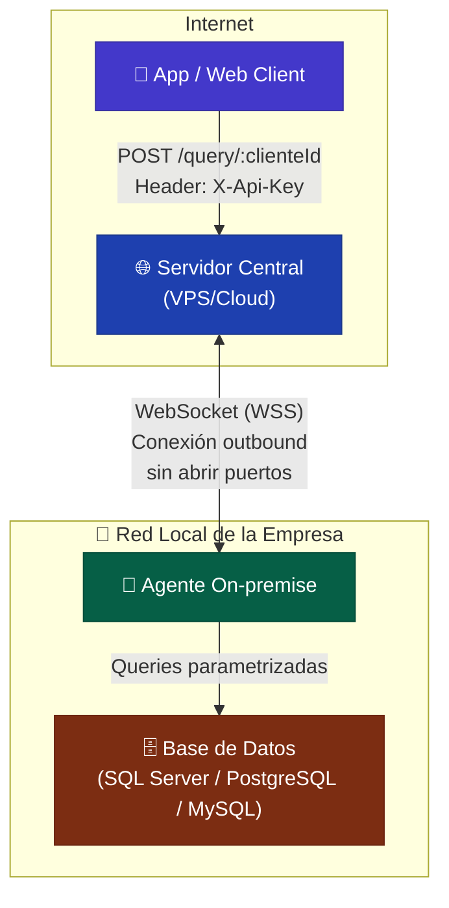
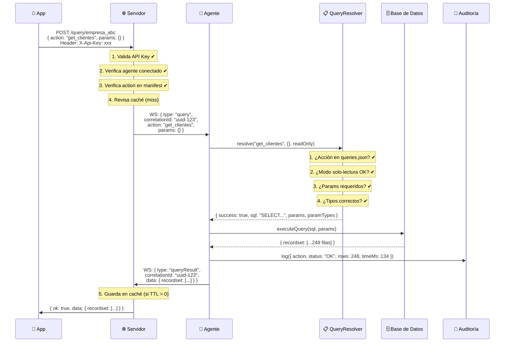
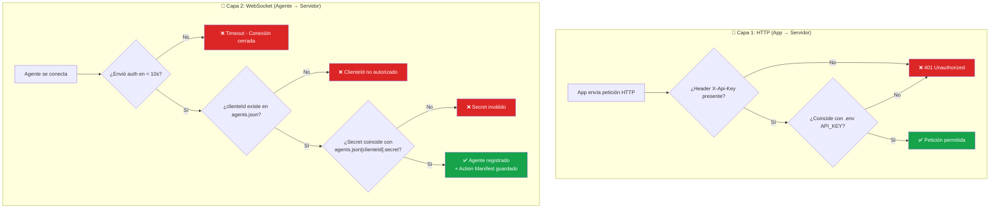
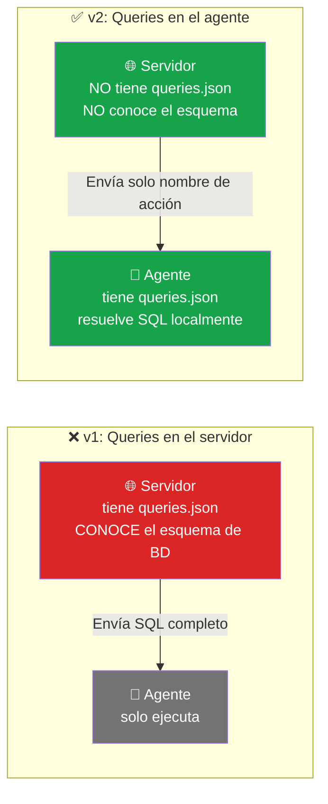
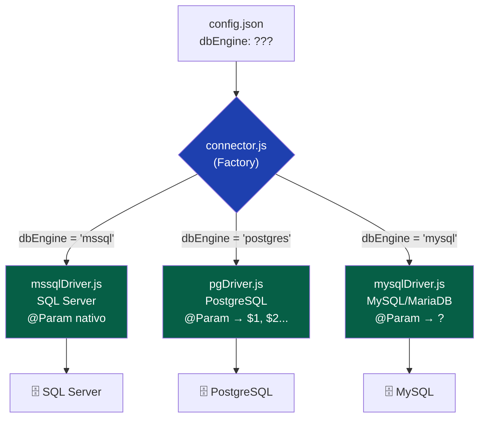
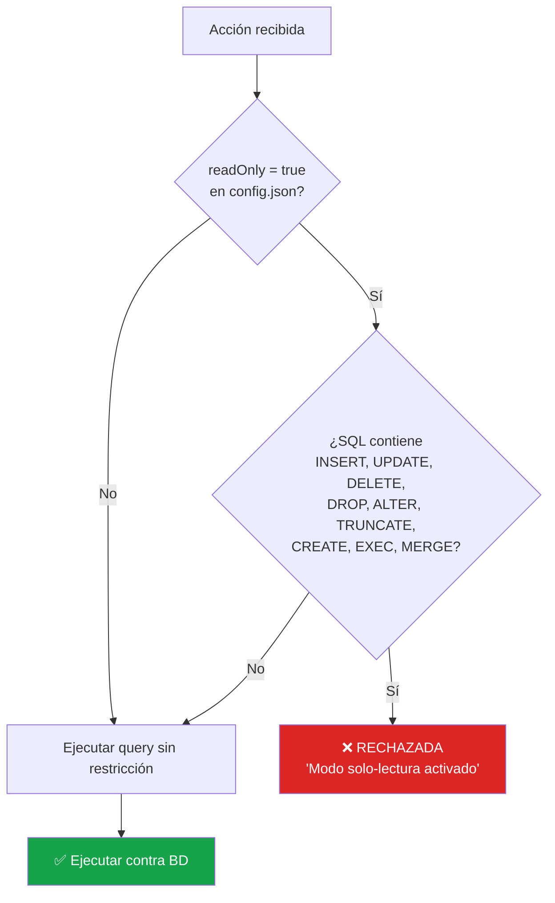

# gdata-tunnel v2 — Walkthrough Completo

## Resumen

Se implementó el proyecto `agentstructure` como evolución de `gdataagent` + `gdataserver`, con las siguientes mejoras:

| Mejora | Archivo(s) clave |
|---|---|
| Queries definidas en el agente | [queries.json](file:///c:/Users/carlo/OneDrive/Escritorio/TRABAJO/agentstructure/agent/queries.json) |
| Secreto por agente (no global) | [agents.json.example](file:///c:/Users/carlo/OneDrive/Escritorio/TRABAJO/agentstructure/server/agents.json.example) |
| Action Manifest | [agent/index.js](file:///c:/Users/carlo/OneDrive/Escritorio/TRABAJO/agentstructure/agent/index.js#L73-L78), [registry.js](file:///c:/Users/carlo/OneDrive/Escritorio/TRABAJO/agentstructure/server/lib/registry.js) |
| Auditoría / Log de accesos | [audit.js](file:///c:/Users/carlo/OneDrive/Escritorio/TRABAJO/agentstructure/agent/lib/audit.js) |
| Tipos de parámetros | [queryResolver.js](file:///c:/Users/carlo/OneDrive/Escritorio/TRABAJO/agentstructure/agent/lib/queryResolver.js) |
| API Key (App → Servidor) | [apiKey.js](file:///c:/Users/carlo/OneDrive/Escritorio/TRABAJO/agentstructure/server/middleware/apiKey.js) |
| Multi-motor de BD | [connector.js](file:///c:/Users/carlo/OneDrive/Escritorio/TRABAJO/agentstructure/agent/db/connector.js), [drivers/](file:///c:/Users/carlo/OneDrive/Escritorio/TRABAJO/agentstructure/agent/db/drivers) |
| Modo solo-lectura | [queryResolver.js](file:///c:/Users/carlo/OneDrive/Escritorio/TRABAJO/agentstructure/agent/lib/queryResolver.js#L38-L39) |

---

## Estructura de Archivos

```
agentstructure/
├── server/                          # Servidor central (VPS/Cloud)
│   ├── index.js                     # Entry point del servidor
│   ├── package.json
│   ├── .env.example                 # Variables de entorno (PORT, API_KEY, etc.)
│   ├── .gitignore
│   ├── agents.json.example          # Registro de agentes autorizados (secret por agente)
│   ├── middleware/
│   │   └── apiKey.js                # Middleware de autenticación HTTP (X-Api-Key)
│   ├── routes/
│   │   └── api.js                   # Endpoints REST (POST /query, GET /agents, GET /status)
│   ├── ws/
│   │   └── socketHandler.js         # Manejo de conexiones WebSocket (auth + queryResult)
│   └── lib/
│       ├── registry.js              # Registro en memoria de agentes + action manifests
│       └── cache.js                 # Caché en memoria (node-cache)
│
└── agent/                           # Agente on-premise (red del cliente)
    ├── index.js                     # Entry point del agente
    ├── package.json
    ├── .gitignore
    ├── config.json.example          # Config de conexión (BD, servidor, readOnly, dbEngine)
    ├── queries.json                 # Lista blanca de queries con tipos de parámetros
    ├── lib/
    │   ├── queryResolver.js         # Resuelve action→SQL, valida params, modo read-only
    │   └── audit.js                 # Log de auditoría diario
    └── db/
        ├── connector.js             # Factory multi-motor
        └── drivers/
            ├── mssqlDriver.js       # Driver SQL Server (mssql)
            ├── pgDriver.js          # Driver PostgreSQL (pg)
            └── mysqlDriver.js       # Driver MySQL/MariaDB (mysql2)
```

---

## Diagramas

### 1. Diagrama de Arquitectura General



### 2. Diagrama de Flujo de una Petición (Query Flow)



### 3. Diagrama de Autenticación (Doble Capa)



### 4. Diagrama de Soberanía del Dato (Comparación v1 vs v2)



### 5. Diagrama del Factory Pattern (Multi-Motor de BD)



### 6. Diagrama del Modo Solo-Lectura



---

## Cómo instalar

### Servidor (en el VPS/Cloud)

```bash
cd agentstructure/server
cp .env.example .env           # Editar: API_KEY, PORT
cp agents.json.example agents.json  # Editar: agregar agentes y sus secrets
npm install
npm start
```

### Agente (en la red del cliente)

```bash
cd agentstructure/agent
cp config.json.example config.json  # Editar: clienteId, serverUrl, agentSecret, BD
# Personalizar queries.json según las tablas del cliente
npm install
npm start
```

---

## Ejemplo de petición desde la App

```bash
curl -X POST http://localhost:3500/query/empresa_abc \
  -H "Content-Type: application/json" \
  -H "X-Api-Key: mi-clave-de-api" \
  -d '{ "action": "get_clientes", "params": {} }'
```

Respuesta:
```json
{
  "ok": true,
  "fromCache": false,
  "data": {
    "recordset": [
      { "IDCliente": "001", "razon_social": "Empresa ABC", ... }
    ],
    "rowsAffected": [248]
  }
}
```

---

## Ejemplo de Log de Auditoría

Archivo: `agent/logs/audit_2026-05-22.log`
```
[2026-05-22 09:15:23] ACTION: get_clientes | PARAMS: {} | STATUS: OK | ROWS: 248 | TIME: 134ms
[2026-05-22 09:15:45] ACTION: get_cuentas_cobrar_by_client | PARAMS: {"IdCliente":"005"} | STATUS: OK | ROWS: 3 | TIME: 89ms
[2026-05-22 09:16:02] ACTION: delete_all | PARAMS: {} | STATUS: ERROR | ERROR: Acción desconocida o no permitida: "delete_all" | TIME: 0ms
```
